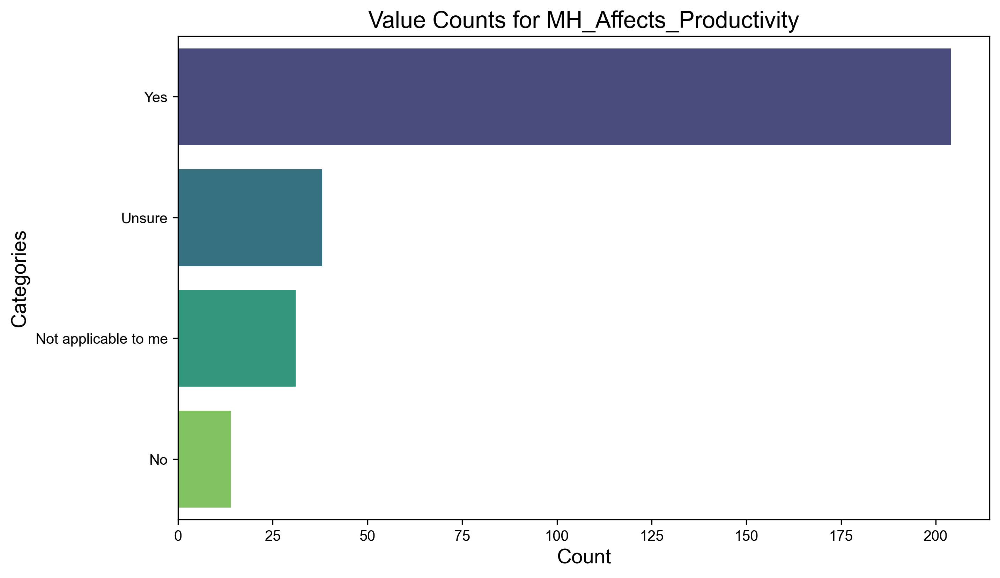
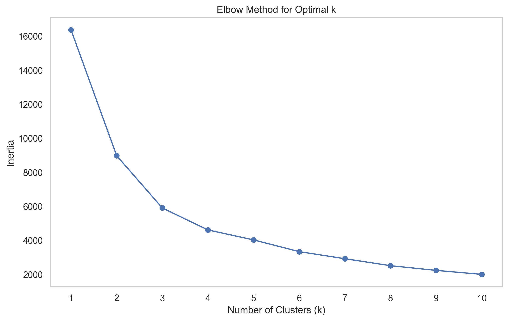
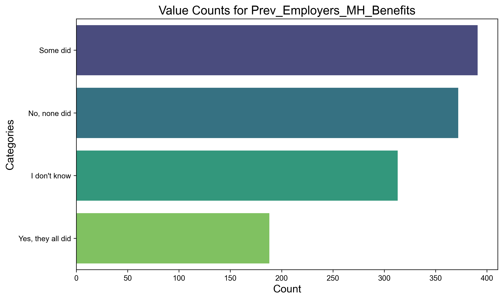
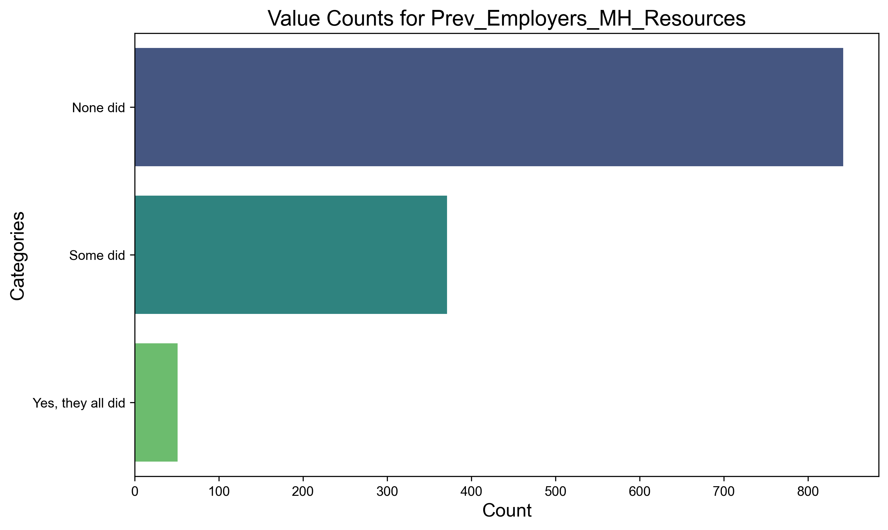
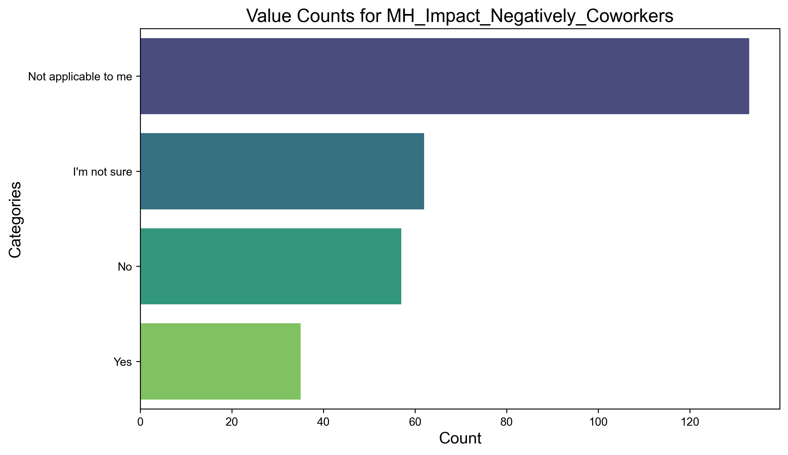

# Visualization Catalog

## Demographics Analysis
### Gender and Age Distribution

Distribution analysis of gender representation in survey respondents.

Age distribution of survey participants (18-65 years).

### Geographic Distribution

Geographic distribution of respondents by country.

Distribution of US-based respondents by state.

### Work Demographics

Distribution of respondents across different job roles.

Analysis of remote work preferences and arrangements.

### Mental Health Demographics

Analysis of mental health disorders by gender.

Relationship between age and mental health disorders.

## Mental Health Analysis
### Treatment and Benefits

Analysis of treatment-seeking behavior.

Distribution of mental health benefits across companies.

### Workplace Impact

Analysis of mental health impact on career progression.

Impact of mental health on workplace productivity.

### Workplace Support

Availability of mental health resources from employers.

Analysis of mental health leave policies and their accessibility.

### Disclosure and Comfort

Comfort levels in discussing mental health with coworkers.

Comfort levels in discussing mental health with supervisors.

## Company Analysis
### Company Demographics

Distribution of respondents across different company sizes.

Comparison between tech and non-tech companies.

### Company Policies

Analysis of physical health policies and consequences.

Analysis of previous employer practices.

## Correlation Analysis

Correlation matrix showing relationships between variables.

Visualization of missing data patterns across variables.

## Clustering Analysis
### PCA Results

Principal Component Analysis results.

PCA results with K-means clustering.

Elbow method for determining optimal cluster count.

## Privacy Analysis

Analysis of anonymity protection in mental health support.

### Treatment Impact

Impact of effective treatment on work performance.

Impact of ineffective treatment on work performance.

### Historical Analysis

Analysis of family history of mental health conditions.

Analysis of past mental health disorders.

### Resource Awareness

Awareness of local mental health resources.

Awareness of mental health benefit options.

### Workplace Communication

Analysis of formal mental health discussions in workplace.

Perceived negative consequences of mental health disclosure.

### Company Size Impact

Relationship between company size and mental health benefits.

Available mental health options across different company sizes.

## Previous Employer Analysis
### Historical Support

Mental health benefits from previous employers.

Resource availability at previous employers.

### Previous Workplace Culture

Mental health discussions at previous employers.

Priority given to mental health by previous employers.

## Disclosure Patterns
### Client Interactions

Patterns of mental health disclosure to clients.

Negative impacts of client disclosure.

### Coworker Interactions

Patterns of mental health disclosure to coworkers.

Negative impacts of coworker disclosure.

## Diagnosis and Conditions

Distribution of diagnosed mental health conditions.

Professional diagnosis patterns.

## Tech Industry Specific

Distribution of tech-related roles.

Geographic distribution of work locations.

## Team Member Perceptions
### Workplace Impact

Analysis of team members' perceptions of mental health issues.

Documentation of unsupportive responses to mental health issues.

### Observed Consequences

Observed negative consequences in current workplace.

Observed consequences in previous workplaces.

## Treatment and Support Analysis
### Medical Coverage

Analysis of medical coverage for mental health treatment.

### Treatment Patterns

Age distribution of treatment-seeking individuals.

Distribution of mental health benefits by gender.

## Work Impact Analysis
### Productivity Measures

Percentage of work time affected by mental health issues.

### Future Employment

Willingness to discuss mental health with potential employers.

Willingness to discuss physical health with potential employers.

## Geographic Analysis
### Work Location

Distribution of work locations by country.

Distribution of work locations by state.

## Additional Analyses
### Privacy and Protection

Anonymity protection at previous employers.

Relationship between anonymity protection and treatment seeking.

### Disclosure Impact

Factors making employees less likely to reveal mental health issues.

### Employment Status

Distribution of self-employed versus employed respondents.

## Remote Work Analysis
### Remote Work Patterns

Analysis of remote work arrangements and preferences.

### Remote Work Impact

Employee preferences for remote work arrangements.

## Gender-Based Analysis
### Communication Comfort

Gender differences in comfort discussing mental health with coworkers.

### Gender Distribution

Detailed breakdown of gender distribution among respondents.

## Previous Employment Analysis
### Supervisor Interactions

Willingness to discuss mental health with previous supervisors.

### Coworker Interactions

Willingness to discuss mental health with previous coworkers.

## Physical Health Comparisons
### Previous Employer Attitudes

Negative consequences related to physical health at previous employers.

### Current Employer Attitudes

Negative consequences related to physical health at current employer.

## Clustering Insights
### Advanced Analysis

PCA results with K-means clustering and identified cluster centers.

---

Note: All visualizations were generated on November 23, 2024. The date prefix in filenames (20241123) indicates the generation date.

## Usage Guidelines
- All visualizations are stored in category-specific directories under the `images` folder
- High-resolution images (300 DPI) suitable for presentations and reports
- Interactive versions of these visualizations may be available in the original Jupyter notebook

## Categories Overview
1. Demographics Analysis: 21 visualizations
2. Mental Health Analysis: 37 visualizations
3. Company Analysis: 9 visualizations
4. Correlation Analysis: 2 visualizations
5. Clustering Analysis: 4 visualizations
6. Privacy Analysis: 1 visualization
7. Remote Work Analysis: 2 visualizations
8. Gender-Based Analysis: 2 visualizations
9. Physical Health Comparisons: 2 visualizations

Total Visualizations: 85

